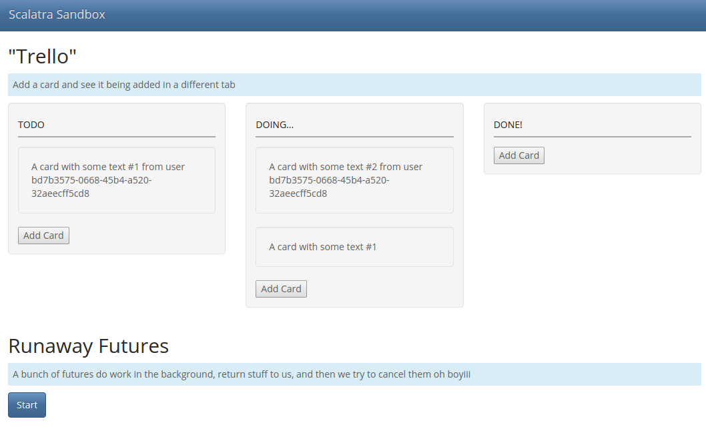

# Scala Atmosphere Websockets Sandbox #

#### ...with Scala, Scalatra, and Atmosphere Websockets! Special appearance by comedian Long Running Process. Music by DJ Drag'n'Drop. Warm up by a Trello Impersonator! Set design by Bootstrap. Catering by KnockoutJS.



## What it does:
  * A newly-added "Trello" card shows up in other clients in real-time.
  * An example of utilizing all cores with Scala futures to do something, and then aborting them via client.

## Build & Run ##

**All** you need is Java installed.

```sh
$ cd scalatra-sandbox
$ ./sbt
> container:start
> browse
```

If `browse` doesn't launch your browser, manually open [http://localhost:8080/](http://localhost:8080/) in your browser.
